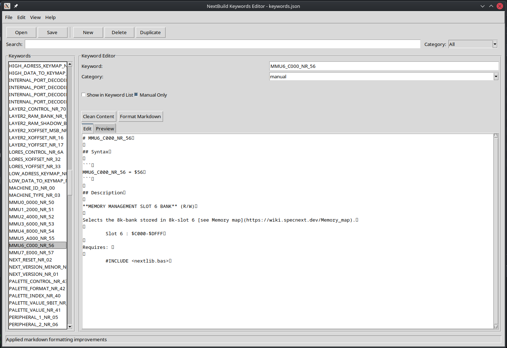
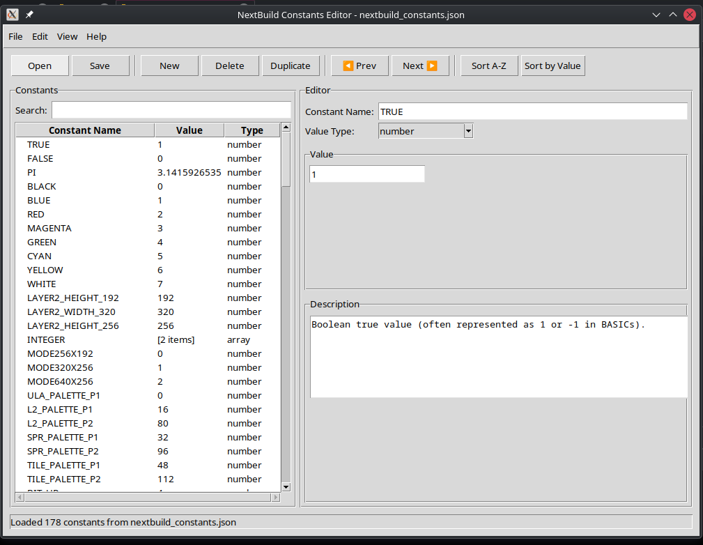
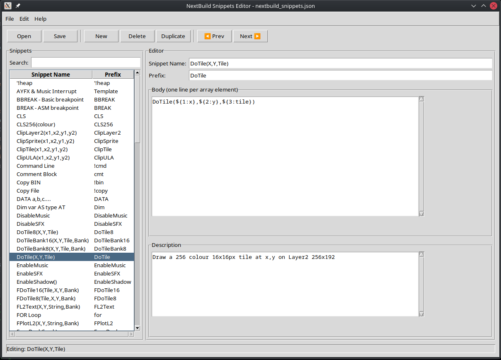

## NextBuild Editor Menu

A menu-driven launcher for NextBuild editors and other tools.

### Usage

Run the menu script:
```bash
./editor_menu.sh
```

Then select from the available options: 
- 1) Keywords Editor (jsonfiles/keywords.json)
- 2) Constants Editor (jsonfiles/nextbuild_constants.json)
- 3) Snippets Editor (jsonfiles/nextbuild_snippets.json)
- 4) Copy to Live (copy_to_live.sh)


### Copy to Live

The copy to live script copies the jsonfiles to the live directory. This is used to test the editors in the live environment in a Virtual Machine.

The jsonfiles folder contains all three json files that are used by the NextBuild Studio extension.
- jsonfiles/keywords.json
    - This file contains the keywords that are used by the NextBuild Studio extension.
    - 
- jsonfiles/nextbuild_constants.json
    - This file contains the constants that are used by the NextBuild Studio extension.
    - 
- jsonfiles/nextbuild_snippets.json
    - This file contains the snippets that are used by the NextBuild Studio extension.
    - 

The copy to live script copies these files to the live directory.

The live directory is:
- /home/user/Applications/NextBuildStudio/resources/app/extensions/em00k.nextbuild-viewers/data/
- /home/user/Applications/NextBuildStudio/resources/app/extensions/em00k.nextbuild-viewers/snippets/

The live directory is the directory that the NextBuild Studio extension is installed in on a test system/vm

CREDITS:
    - Jose Rodriguez-Rosa - ZX Basic Compiler https://github.com/boriel-basic/zxbasic help references
